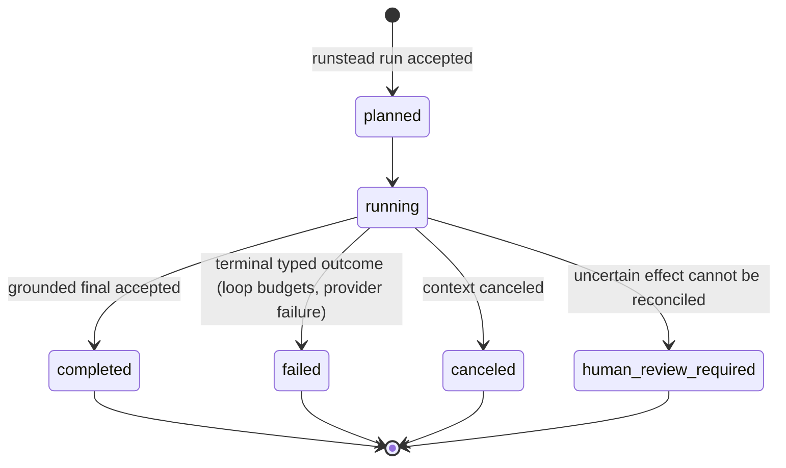
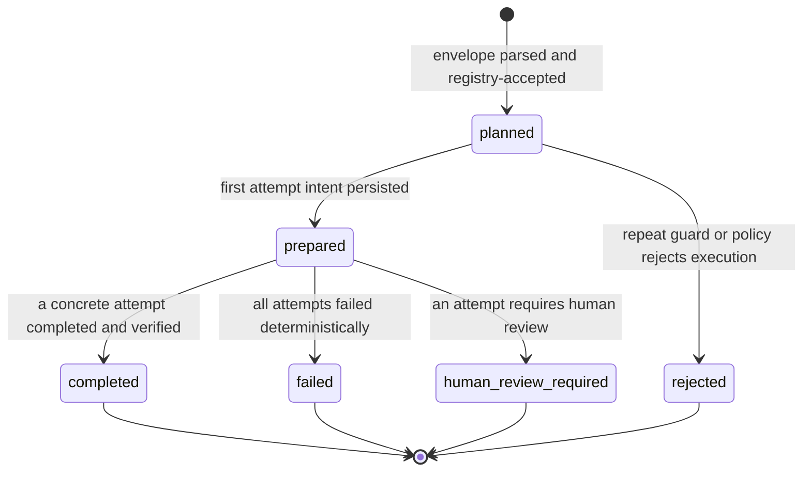
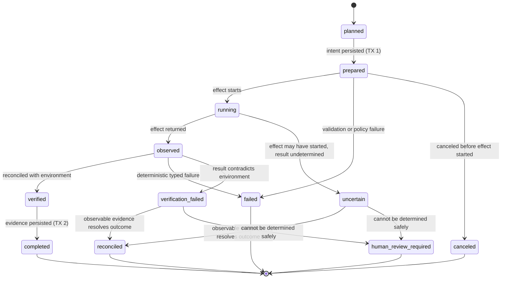
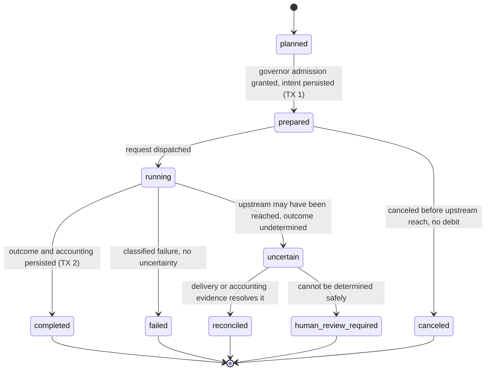

# ADR 0001 — Durable execution contract

**Status:** accepted
**Date:** 2026-08-07
**Milestone:** M2 — Durable state and recovery
**Consumers:** #8 (persistence schema), #9 (resume and recovery)
**Relates to:** #7 (bounded read-only loop), #21 (account governor), #29
(authoritative attempt receipts), #38 (delivery states and idempotency)

This record fixes the execution vocabulary and crash boundaries that #8 and #9
must implement. It does not select a SQLite driver, write migrations, define
WAL/fsync/backup policy or implement any persistence. Concepts that do not
exist in the runtime yet are marked as **design contract for #8/#9** and must
not be presented as implemented behavior.

## 1. Persistence model: transactional journal + operational projections

Runstead persists task state as a transactional journal plus operational
projections:

- operational tables hold the current state the runtime needs directly:
  task, action and attempt status, evidence, budget and circuit state;
- an append-only `events` journal records meaningful transitions for
  inspection, audit and recovery;
- every projection change and its corresponding event are committed in the
  **same SQLite transaction**;
- current state can be reconstructed from persisted records plus observable
  environment evidence.

Runstead does not adopt a generic Event Sourcing framework and does not rebuild
runtime state by re-executing historical calls. The journal is a record of
transitions, not a command queue. The operational projection is authoritative
for the next loop step; the journal is authoritative for explaining how that
projection came to be and for detecting crash windows.

Why this is adequate:

- the runtime reads a small, well-known set of current-state facts (task
  status, attempt states, budgets, evidence IDs); direct rows serve that
  better than folding every read through an event stream;
- the journal provides the append-oriented history required by #8 and the
  reconciliation context required by #9 without event-sourcing machinery;
- Runstead is a single-writer CLI process over one SQLite file; there is no
  distributed coordination to justify a framework;
- atomic projection-plus-event commits keep the journal truthful about which
  state existed when.

## 2. External-effect boundary

**Invariant: no SQLite transaction may remain open while an external effect is
executing.** External effects include provider calls, filesystem/Git work,
subprocesses, network I/O and human approval. There is no atomicity between
SQLite and any external effect; SQLite transactions are atomic only over
SQLite records.

The minimum ordering around one external effect:

```text
TX 1
  create/persist action and attempt
  record intent
  move attempt to prepared
  append corresponding event
COMMIT

execute the external effect OUTSIDE the SQLite transaction

observe/reconcile the environment

TX 2
  persist result/evidence or uncertain state
  update the operational projection
  append corresponding event
COMMIT
```

A crash between TX 1 and TX 2 leaves an explicit `prepared` attempt that
requires reconciliation. Transaction rollback must never erase the only record
that an external effect may have started.

Crash windows:

| Window | Persisted | External effect possible | Recovery behavior |
| --- | --- | --- | --- |
| Before TX 1 commit | nothing | no | No trace exists. Starting fresh is safe; nothing to reconcile. |
| After TX 1, before the effect | attempt `prepared` | no | `prepared` alone cannot distinguish this window from a crash during the effect, because the `running` marker is in-memory. Reconcile from the environment first: re-run only if the operation is provably replay-safe, otherwise cancel with an explicit record or escalate. |
| During the effect | attempt `prepared` | yes, partial or complete | Attempt is `uncertain`. Reconcile from observable evidence; if the outcome cannot be determined safely, `human_review_required`. |
| After the effect, before TX 2 | attempt `prepared` | yes, complete | Attempt is `uncertain` until reconciled from the environment. Never silently re-execute. |
| After TX 2, before the next model turn | result/evidence + event | yes, complete | Safe. The next turn continues from the persisted projection. |

`prepared` is deliberately the only durable state around the effect boundary:
it is never proof that the effect did not start. Recovery must reconcile from
observable environment evidence before deciding whether a new execution is
permitted.

The same two-transaction ordering applies to provider attempts: TX 1 persists
the provider request intent and `client_request_id` before dispatch, the
provider call happens outside any SQLite transaction, and TX 2 persists the
classified outcome, delivery evidence and accounting result.

## 3. Identities

| Identity | Meaning | Origin | Runtime today |
| --- | --- | --- | --- |
| `task_id` | one durable user task | Runstead composition root (`cmd/runstead`, currently `cli-<unixnano>`) | process-local string; M2 persists it |
| `action_id` | one logical model proposal (a parsed `<runstead_action>` envelope) | Runstead at action acceptance | **design contract for #8/#9**; no persistent identity exists yet |
| `execution_id` | one concrete execution attempt (tool or provider), Runstead-owned. This is the identity #25 calls `attempt_id`; the name is changed here so it cannot collide with upstream receipt attempt IDs. | Runstead at attempt creation | **design contract for #8/#9**; runtime has no attempt rows yet |
| `client_request_id` | one admitted provider request | the loop, per model turn (`<task_id>-<turn>` in `internal/agent/loop.go`) | in-memory, governor-scoped; M2 persists it |
| `receipt_attempt_id` | identity of one authoritative upstream model invocation from #29 (`provider.AttemptReceipt.AttemptID`) | the upstream producer, per receipt | in-memory, request-scoped in `provider.AttemptReceiptSet`; M2 persists it only as evidence |
| fingerprint | heuristic repeat/loop evidence: SHA-256 of tool name + canonical arguments (`protocol.ActionFingerprint`) | parser, caller-owned | used by `agent.repeatGuard` with a workspace signature |
| `idempotency_key` | a key accepted by an external receiver that explicitly documents and tests idempotency | only where such a contract exists | none today; never invented client-side |

These are conceptually distinct and must remain so in the schema:

- the **`execution_id` space is Runstead-owned**: tool attempts and provider
  attempts. The **`receipt_attempt_id` space is upstream-owned** (#29): one
  governed provider execution may record zero or more receipt attempt IDs.
  A receipt attempt ID may serve as the identity of its persisted evidence
  record (a `provider_attempt_receipts` row), but it is never the identity of
  a Runstead execution (`execution_id`). Even when a provider execution has
  exactly one receipt, the two identifiers remain distinct and are stored in
  different entities;
- an **execution ID** identifies one concrete Runstead execution attempt (tool
  or provider) and is created at attempt time; it is never equal to or derived
  from a receipt attempt ID;
- a **request ID** correlates one admitted provider request end to end;
- a **fingerprint** is heuristic evidence of repetition. It never guarantees
  that a previous result can be reused: `read_file`, `git_status` and
  `git_diff` may legitimately return different results after the workspace
  changes. Result reuse requires a tool-specific rule and matching
  environment preconditions, never fingerprint equality alone. Fingerprint
  equality never merges actions: every accepted envelope is a distinct
  `action_id` even when the repeat guard later rejects it;
- an **idempotency key** exists only when the external receiver supports a
  documented, tested idempotency contract. Runstead never assumes an upstream
  honors an idempotency header without such a contract.

## 4. State machines

State machines are per-entity and semantically correct rather than one shared
enumeration. `planned`, `prepared`, `running`, `observed`, `verified` and
`completed` are the core spine; `failed`, `uncertain`, `verification_failed`,
`reconciled` and `human_review_required` are terminal or recovery branches
used where they apply.

### Task lifecycle



The task row stores the current status as a convenience projection. The
`events` journal retains the full history; terminal loop outcomes map to the
existing `agent.Outcome` values (`completed`, `steps_exhausted`,
`corrections_exhausted`, `repeated_action`, `time_budget_exhausted`,
`provider_budget_exhausted`, `account_delay_timeout`, `account_circuit_open`,
`canceled`, `final_not_grounded`, `provider_failure`, `final_incomplete`).

### Logical action lifecycle



Every accepted envelope is a distinct action with its own `action_id`,
created when the parser accepts it and before any execution decision. The
repeat guard then decides whether a tool attempt may be created: a proposal
whose fingerprint matches a recorded one under the same workspace signature
is rejected as `rejected` and becomes a correction without creating a tool
attempt. An action is not "done" because it was proposed; it is done only
when a concrete attempt produced verified evidence. Fingerprint equality
never merges actions and never reuses results; it is heuristic evidence for
the execution decision only.

### Tool attempt lifecycle



Key transitions:

| Transition | Precondition | Durable record | External effect may have occurred? | Recovery behavior |
| --- | --- | --- | --- | --- |
| `planned` → `prepared` | action accepted; policy allows | TX 1: attempt row + event | no | Re-run only if replay-safe, else cancel explicitly. |
| `prepared` → `running` | effect boundary entered | in-memory running marker (no open transaction) | yes, starts here | Reconcile from the environment. After a restart, a persisted `prepared` row is ambiguous (the running marker was in-memory) and never authorizes direct re-execution of a non-replay-safe operation. |
| `running` → `observed` | effect returned | captured observation | yes | Verify against environment. |
| `observed` → `verified` | tool-class reconciliation rule satisfied | verification record | yes | Persist verified state. |
| `verified` → `completed` | evidence persisted | TX 2: result/evidence + event | yes | Terminal. Safe to reference in later turns. |
| → `failed` | deterministic typed failure (`tools.FailureCode`) | failure classification + event | only if the effect had started | Fail-closed; no silent retry. |
| → `uncertain` | effect may have started, outcome undetermined | uncertain record + event | yes | Reconcile from observable evidence or escalate; never auto-retry. |
| → `verification_failed` | observation contradicts the environment | record with both sides of the evidence | yes | Reconcile or escalate. |
| `uncertain`/`verification_failed` → `reconciled` | observable evidence resolves the outcome | reconciliation record + event | n/a | Continue from reconciled state. |
| → `human_review_required` | outcome cannot be determined safely | record with evidence summary | yes | Stop; a human must decide before any new execution. |

### Provider attempt lifecycle



The provider attempt lifecycle is the persisted counterpart of the existing
governor permit (`governor.Permit`): admission (`governor.Admit`) precedes
`Start`/`StartReceiptAware`, the provider `Complete` call runs outside any
SQLite transaction, and `Finish`/`FinishWithAttemptReceipts` produce the
accounting outcome that TX 2 persists. An executor retry is a new governed
completion, never a silent replay of the same provider attempt.

## 5. Recovery classes

Tool invocations are classified by recovery behavior, not only by tool name.
Classification is a property of the operation's effect and reconciliation
contract; future write-capable tools must be classified explicitly when they
are introduced.

| Class | Definition | Retry/replay rule |
| --- | --- | --- |
| 1. Replay-safe observation | Pure read; no mutation. Result may legitimately change between runs. | May be re-run freely within loop and governor budgets. A prior result is never reused automatically; fingerprint is not a cache key. |
| 2. Local effect with deterministic reconciliation | Mutates only local state that Runstead can inspect (files, Git object database, process exit status). | Re-run only after reconciliation proves no effect occurred; otherwise verify and continue. |
| 3. Externally visible effect with contractual idempotency | Receiver explicitly documents and tests idempotency for the supplied key. | May retry with the contractual key; every retry is still a new governed attempt. |
| 4. Uncertain or irreversible effect requiring human review | Effect may have occurred and cannot be verified safely, or has no idempotency contract. | Never auto-retry. `human_review_required` with persisted evidence. |

Example classification:

| Operation | Class | Rationale and reconciliation |
| --- | --- | --- |
| `read_file` | 1 | Workspace read. Re-run after interruption; fresh evidence each time. |
| `list_files` | 1 | Workspace read. Same as above. |
| `search_text` | 1 | Workspace read (`rg` or Go fallback). Same as above. |
| `git_status` | 1 | Read-only Git subprocess. Same as above. |
| `git_diff` | 1 | Read-only Git subprocess. Same as above. |
| `write_file` (#10, with before-hash) | 2 | Compare before-hash, after-hash and file content. Reconcile from the filesystem; write only if reconciliation proves the file is unchanged since the recorded before-hash. Implemented in `internal/tools` with `effect_after_hash` persisted at TX 1. |
| `apply_patch` (#10) | 2 | Reconcile from the resulting diff and hashes. A patch whose effect is fully observable can be verified or reverted deterministically; ambiguous partial application escalates. Implemented with a strict in-memory unified-diff applier (no shell `patch`). |
| Test/build recipe (future) | 2 | Reconcile from captured exit status and output; re-run is safe only when the recipe itself has no side effects. A recipe with side effects is classified 4. |
| Git commit (future) | 2 | Local mutation with deterministic reconciliation via `git log`/`git status`/reflog. If the commit exists, never create a duplicate; if it does not, a new commit is a new attempt. |
| Git push (future) | 4 | Remote state is not locally determinable and push has no idempotency contract. A retry may duplicate or surprise the remote. Reconcile from remote evidence or require human review. |
| Generic HTTP effect (future) | 3 or 4 | Class 3 only when the receiver's idempotency contract is explicit and tested; otherwise class 4. |
| `run_recipe` (#26, operator-declared recipes) | 4 | Process effects are not generically reconcilable: a prepared process attempt left by a crash stops automatic continuation with `human_review_required`, never blindly re-run. The separately reviewed policy boundary (recipe catalog + capability policy) is #26. Generic shell remains out of scope. |

## 6. Uncertain outcomes

Fail-closed rule:

> If an external effect may have started and the outcome cannot be determined,
> the attempt is `uncertain`. It must never be automatically converted into a
> success, a failure or a new attempt.

Before any new execution of the same intent, one of the following must occur:

1. reconciliation based on observable evidence, which must produce a recorded,
   typed decision (`reconciled`, `completed`, or a deterministic `failed`); or
2. escalation to `human_review_required` when the state cannot be determined
   safely.

For provider requests this preserves the conservative accounting already
implemented by the governor (#21/#29): when upstream may have been reached,
accounting never pretends that nothing occurred. The M1 runtime already
records a conservative uncertain debit with an `uncertain_attempt` event,
marks telemetry unsafe and blocks later admission when a finalized receipt set
is missing or structurally invalid (`governor.permit.go`). Persisting a
provider attempt as `uncertain` must keep that charge visible and never
silently reinterpret it on restart.

## 7. Relation to issue #38 (delivery states)

#38 is not implemented here. This contract keeps #38 possible and consistent
by treating **delivery state as transport-level information orthogonal to the
persisted provider-attempt lifecycle**.

- `client_request_id` is the correlation key between a persisted provider
  attempt and its transport-level delivery record;
- delivery states (`not_sent`, `sent_confirmed`, `sent_unconfirmed`,
  `response_started`, `completed`) describe what is known about the delivery
  of one request, not the persisted lifecycle of the attempt;
- the provider attempt lifecycle (`planned` → `prepared` → `running` →
  `completed`/`failed`/`uncertain`) remains the authoritative persisted state
  that #8 stores and #9 reconciles.

| #38 delivery state | What is known | Compatible provider lifecycle states | Retry/recovery rule |
| --- | --- | --- | --- |
| `not_sent` | no upstream model attempt was dispatched; the upstream was not reached. The request may still have left Runstead and reached a gateway/executor; the boundary #38 models is the upstream invocation, not the local process | `planned` / `prepared` | Retry is replay-safe within budgets. |
| `sent_confirmed` | delivery to the upstream was confirmed; the effect is in flight and may end in any outcome (success, 4xx, timeout, cancellation) | `prepared` → `running` → `completed` / `failed` / `uncertain` | No auto-retry; the lifecycle outcome comes from the attempt classification, never from the delivery state alone. |
| `sent_unconfirmed` | delivery is ambiguous; the upstream may or may not have been reached | `running` / `uncertain` | No auto-retry; treat conservatively as `uncertain`, reconcile from accounting/delivery evidence or escalate to `human_review_required`. |
| `response_started` | the response stream started; the effect occurred | `running` (final outcome comes from classification: `completed` / `failed` / `uncertain`) | No retry; complete the response and classify the result. |
| `completed` | the full response was delivered | `completed`, or `failed` when classifying the delivered content fails (empty or malformed) | Terminal for delivery; the persisted lifecycle outcome still comes from the attempt classification. |

Delivery state never determines the persisted lifecycle by itself; it
constrains which outcomes are possible and which recovery action is safe. The
one strong implication is `sent_unconfirmed`: it must be treated as a provider
attempt `uncertain` with no auto-retry, because the conservative debit stands
when the upstream may have been reached. Delivery states map only to the
provider-attempt lifecycle states defined above; there is no provider-attempt
`observed` state (that state belongs to the tool-attempt lifecycle).
Persisting delivery state must not become a second, contradicting lifecycle
for the same attempt.

## 8. Minimum conceptual schema for #8

Conceptual tables only; no migrations. The SQLite driver, migrations,
journal/synchronous pragmas, backup and corruption policy are decided in #8
from measured behavior, not here.

| Table | Purpose | Identity | Essential relationships | Main invariants |
| --- | --- | --- | --- | --- |
| `tasks` | durable task root | `task_id` | parent of actions, attempts, evidence, events | status is a projection; history lives in `events`; cleanup never cascades to `events`. |
| `actions` | one logical model proposal | `action_id` | `task_id`; parent of `tool_attempts` | deterministic per-task ordering, e.g. `UNIQUE(task_id, action_sequence)`; one row per accepted envelope, including proposals the repeat guard rejects (`rejected`); stores fingerprint only as repeat/loop evidence. |
| `tool_attempts` | one concrete tool execution | `execution_id` | `task_id`, `action_id`; result referenced by evidence | concrete row per attempt with state, timestamps, classification and outcome; a mutable `retry_count` never replaces attempt rows. |
| `provider_attempts` | one governed provider completion | `execution_id` | `task_id`; `client_request_id`; one-to-many `provider_attempt_receipts` | `UNIQUE(task_id, client_request_id)`; outcome class, `upstream_reached` and debit recorded; an `uncertain` outcome cannot be silently reinterpreted; its identity is Runstead-owned and never equal to a receipt attempt ID. |
| `provider_attempt_receipts` | authoritative upstream receipt evidence from #29 | `receipt_attempt_id` | `task_id`, `provider_attempts.execution_id` | the receipt attempt ID is the identity of its evidence record, never the identity of a Runstead execution; one provider execution may map to zero or more receipts (M1 policy accepts one per completion in `governor.permit.go`, but the schema models one-to-many so receipt-aware amplification evidence never conflates identities); receipt fields (trigger, outcome, sequence, timestamps) stored sanitized. |
| `tool_results` / evidence | persisted observation data | `evidence_id` (runtime-generated, e.g. `obs-000001`) | `task_id`, `tool_attempts.execution_id` | evidence IDs are never model-chosen; `untrusted` marker preserved; failed observations carry no citable data. |
| `events` | append-only journal | `(task_id, sequence)` | `task_id` only | `UNIQUE(task_id, sequence)`; payload hashes may support integrity checks but are not globally unique event identity; no `ON DELETE CASCADE` from any cleanup path. |
| `approvals` | human approval records | own id per approval | `task_id`, optional `action_id` | only when a later milestone introduces approval gates; not part of the M2 minimum unless #8 demonstrates the need. |
| `checkpoints` | bounded context snapshots for resume | own id | `task_id` | only if #9 demonstrates a context-reconstruction benefit; never a replacement for the journal. |

Persisted governor state (rolling ledger, cooldown, circuit, retained
request/attempt IDs) is also an operational projection and follows the same
rules: projection update plus event in one SQLite transaction, no transaction
spanning external work, and restart must not reset account protection (#21).

Global schema invariants:

1. task-scoped deterministic event ordering: `UNIQUE(task_id, sequence)`;
2. event payload hashes are integrity aids, never identity;
3. concrete attempts are their own records, not retry counters;
4. append-oriented history cannot disappear through normal task cleanup
   (no casual `ON DELETE CASCADE` onto `events`);
5. provider attempts, tool attempts and logical actions are distinct entities;
6. Runstead execution identities (`execution_id`, `action_id`) and upstream
   receipt identities (`receipt_attempt_id`) live in different ID spaces and
   are never interchangeable: a receipt ID may identify its own evidence row
   but never a Runstead execution;
7. an `uncertain` outcome cannot be converted to success, failure or retry
   without a recorded reconciliation;
8. fingerprints are stored only as repeat/loop evidence and are never treated
   as idempotency keys;
9. no SQLite transaction ever spans external work;
10. foreign-key cycles are avoided unless a demonstrated invariant requires
    them (the proposed tables form a strict `tasks → actions →
    tool_attempts → tool_results` hierarchy; `events` references only
    `task_id`; `provider_attempt_receipts` references only `task_id` and
    `provider_attempts`).

## 9. State reconstruction is not deterministic replay

Runstead is not Temporal. It does not and will not offer deterministic
workflow replay of model calls, filesystem state, subprocess execution, Git or
network operations. Recovery means:

1. reconstruct persisted state (tasks, actions, attempts, evidence, governor
   state) from the database;
2. reconcile uncertain **and `prepared`** attempts against current observable
   environment evidence: a persisted `prepared` row never proves that an
   effect did not start, so any operation not provably replay-safe is
   reconciled before a new execution is allowed;
3. continue with **new** executions from a safe boundary, through the same
   governor and provider seams used by #7.

A previous remote provider conversation is never an authority over task state;
provider/session identifiers remain disposable metadata. Repeating a history
of calls to make the same output reappear is neither required nor possible for
non-deterministic model and tool execution.

## 10. Non-decisions

The following are deliberately deferred to the #8 implementation and are not
decided by this ADR:

- SQLite driver selection and justification;
- migrations mechanics and versioning;
- WAL, `synchronous`, busy-timeout, journal or backup policy;
- corruption, torn-write or forensic-copy handling;
- a fast-vs-durable write API;
- `runstead inspect` and `runstead resume` behavior;
- write tools and approval UX were decided by #10 (see `docs/writes.md`);
  the bounded process runner and recipe capability policy were decided by #26
  (see `docs/process-runner.md`); arbitrary shell remains out of scope;
- #38 headers, retry policy and delivery-state persistence;
- #29/#30 producer contract and live activation;
- any claim of exactly-once execution.

The JCode research (`docs/research/jcode-reverse-engineering.md`) documents
JSON snapshot/JSONL journal repair mechanics that are **not** accepted Runstead
design decisions: line-level salvage, glued-JSON recovery,
checkpoint-after-corrupt-line behavior, mandatory forensic copies, corrupt
SQLite page assumptions, and any JCode write/fsync policy. This ADR retains
only the implementation-neutral principles that apply regardless of storage
technology: never lose evidence silently, represent uncertainty explicitly,
distinguish duplication, use typed diagnostics, and reconstruct state without
re-executing history.
