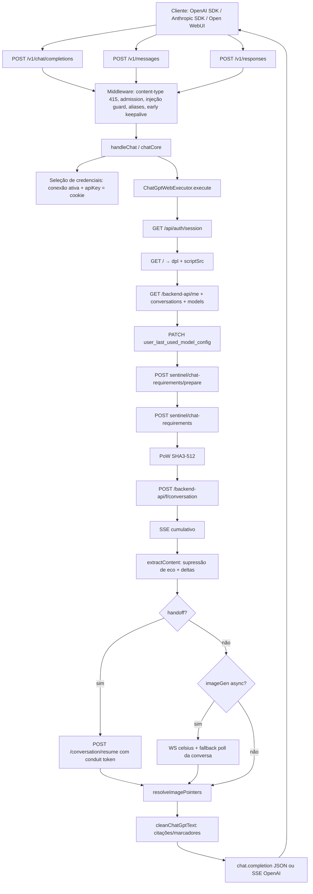

# Engenharia reversa — Executor ChatGPT Web do OmniRoute

**Projeto-alvo:** Runstead
**Referência examinada:** OmniRoute `release/v3.8.50`
**SHA fixado:** `976d670ff3a7712df0c695f13095c43eace5e29b`
**Data da inspeção:** 7 de agosto de 2026
**Idioma:** português do Brasil
**Escopo:** leitura estática do código-fonte e da documentação. Nenhuma execução autenticada, nenhum cookie, token ou conta real. Nenhuma modificação foi realizada no Runstead.

---

## 1. Resumo executivo

O `ChatGptWebExecutor` do OmniRoute é um adaptador **HTTP direto** para o protocolo interno de `chatgpt.com`, autenticado por cookie de sessão NextAuth pertencente ao usuário (`__Secure-next-auth.session-token`). Ele não usa navegador: reproduz o handshake de autenticação, o desafio Sentinel (proof-of-work SHA3-512), o warmup de sessão e o formato SSE cumulativo do backend, e traduz o resultado para OpenAI Chat Completions.

O fluxo completo, reconstruído com evidências de código, é:

```text
POST /v1/chat/completions (ou /v1/messages, /v1/responses)
  → handleChat (src/sse/handlers/chat.ts)
  → chatCore → seleção de credenciais
  → ChatGptWebExecutor.execute()
      1. exchangeSession:        GET /api/auth/session            cookie → JWT (cache 5 min)
      2. fetchDpl:               GET /                            data-build + script src (cache 1 h)
      3. runSessionWarmup:       GET /backend-api/{me,conversations,models}  (cache 60 s)
      4. setUserThinkingEffort:  PATCH /backend-api/settings/user_last_used_model_config (se aplicável)
      5. prepareChatRequirements:
         5a. POST /backend-api/sentinel/chat-requirements/prepare   (prekey com PoW "gAAAAAC", alvo 0fffff)
         5b. POST /backend-api/sentinel/chat-requirements           (com prepare_token → chat-requirements-token)
      6. solveProofOfWork:       SHA3-512(seed + b64(config)) ≤ difficulty → "gAAAAAB…"
      7. POST /backend-api/f/conversation   (action:"next", histórico dobrado no system message)
      8. SSE cumulativo → deltas (supressão de eco, detecção de turno vivo)
      9. handoff Pro → /backend-api/f/conversation/resume (x-conduit-token) ou poll da conversa
     10. limpeza de citações/marcadores privados → OpenAI chat.completion / SSE
```

### Achados centrais para o Runstead

1. **O cookie é a credencial** (`credentials.apiKey`), e o executor troca cookie → access token a cada até 5 minutos, com cache limitado a 200 entradas chaveado por prefixo SHA-256 de 64 bits (correção documentada de colisão de um esquema FNV-1a de 32 bits anterior).
2. **Cada requisição começa conversa nova** (`conversation_id: null`, Temporary Chat por padrão). Não há continuidade de conversa entre turns; o histórico é dobrado no system message para evitar o bug documentado de continuação `[1] → [12] → [1123]`.
3. **O streaming é cumulativo, não delta**: o executor difere `parts[0]` contra o comprimento já emitido e suprime ecos de turns anteriores (só emite depois de ver `status: "in_progress"` para o id do turno corrente).
4. **Tool calling não é nativo**: é emulado por contrato `<tool>{...}</tool>` no prompt, parseado de volta em `tool_calls` (sem streaming token a token quando há tools).
5. **O executor não retenta o POST de conversa (texto)**: 401/403 limpam o cache de token e o request falha; o fallback de conta acontece acima (chatCore/accountFallback). O loop de retry do `BaseExecutor.execute()` (429 intra-URL etc.) **não** se aplica ao chatgpt-web, que sobrescreve `execute()` por inteiro. Há retry apenas em caminhos auxiliares de recuperação: reconexão única do WebSocket de imagem async e re-leitura do handoff (offsets 0..2), irrelevantes para o caminho text-only do Runstead.
6. **Uso de tokens é estimado** (`ceil(len/4)`), não real.
7. **Várias práticas devem ser rejeitadas no Runstead**: impersonação de TLS via `tls-client-node` (perfil Firefox), configuração de fingerprint de navegador no prekey, warmup que imita sequência de page-load para "aquecer" a sessão para o Sentinel, valores de build capturados de um frontend real (`OAI-Client-Version` de abril/2026) sem detector de drift.

---

## 2. SHA e escopo

| Campo | Valor |
|---|---|
| Repositório | https://github.com/diegosouzapw/OmniRoute |
| Branch/tag | `release/v3.8.50` |
| SHA | `976d670ff3a7712df0c695f13095c43eace5e29b` |
| Data do commit | 2026-08-07 13:45:58 -0300 |
| Mensagem | `fix(combo): distinguish pre-dispatch skips from genuine failures to prevent false 503 ALL_ACCOUNTS_INACTIVE (#9630)` |
| Licença | MIT (arquivo `LICENSE`, copyright 2026 diegosouzapw) |
| Tamanho do clone | 261 MB, 11.113 arquivos |

**Escopo examinado** (arquivos e seus imports diretos):

- `open-sse/executors/base.ts` (1.639 linhas)
- `open-sse/executors/index.ts` (registry, 301 linhas)
- `open-sse/executors/chatgpt-web.ts` (3.240 linhas)
- `open-sse/executors/chatgpt-web/models.ts`, `citations.ts`, `handoff.ts`
- `open-sse/executors/chatgptWebErrors.ts`, `chatgptWebTools.ts`
- `open-sse/utils/nextAuthCookie.ts`
- `open-sse/services/chatgptTlsClient.ts` (629 linhas)
- `open-sse/services/chatgptImageCache.ts` (143 linhas)
- `open-sse/translator/webTools.ts` (558 linhas, referência do contrato `<tool>`)
- `src/app/api/v1/chat/completions/route.ts`, `src/app/api/v1/messages/route.ts`, `src/app/api/v1/responses/route.ts`
- `docs/architecture/ARCHITECTURE.md`
- Testes: `tests/unit/chatgpt-web*.test.ts` (10 arquivos, ~3.900 linhas)

**Verificação da Etapa 1 (preparação segura):**

- `postinstall` (`scripts/build/postinstall.mjs`): copia binários nativos já compilados (`better-sqlite3`, `wreq-js`, `tls-client-node`) para o standalone build. Não baixa binários, não executa rede, não instala scripts.
- `prepare`: `husky` (hooks git de desenvolvimento; não há hooks ativos no clone — apenas samples).
- Telemetria: não há PostHog/Sentry/analytics externa no caminho examinado. Existem módulos locais de uso/analytics (`src/lib/db/usageAnalytics.ts`, `usageHistory.ts`) e `src/lib/jobs/autoUpdate.ts` (auto-update do pacote/desktop; invocação ocorre em jobs, fora do caminho do executor).
- Dependências nativas relevantes ao executor: `tls-client-node` (biblioteca compartilhada de impersonação TLS), `wreq-js` (OAuth), `better-sqlite3`. Streaming via arquivo temporário quando `stream: true`.

---

## 3. Árvore de módulos (escopo do executor)

```text
src/app/api/v1/
├── chat/completions/route.ts     → handleChat (guardas, keepalive, aliases)
├── messages/route.ts             → handleChat (formato Anthropic, event: ping)
└── responses/route.ts            → handleChat (responses API, rewrite codex)

src/sse/handlers/chat.ts          → validação profunda, seleção de credenciais, fallback de contas
open-sse/handlers/chatCore.ts     → tradução de formato, execução, tratamento 401/403 (reativo)

open-sse/executors/
├── index.ts                      → registry (70+ executores, aliases, fallback DefaultExecutor)
├── base.ts                       → BaseExecutor (strategy; refresh proativo; loop de retry/fallback)
└── chatgpt-web.ts                → ChatGptWebExecutor (execute() próprio, sem loop do base)
    ├── models.ts                 → MODEL_MAP (dot-form → slug), effort, isPro
    ├── citations.ts              → limpeza de marcadores privados e content_references
    ├── handoff.ts                → resume via /conversation/resume com conduit token
open-sse/executors/chatgptWebErrors.ts    → mapa de mensagens HTTP
open-sse/executors/chatgptWebTools.ts     → modo tool (parse <tool> → tool_calls, SSE terminal)
open-sse/translator/webTools.ts           → prepareToolMessages (injeção do contrato <tool>)
open-sse/services/
├── chatgptTlsClient.ts           → transporte TLS-impersonado (tls-client-node), sidecar, timeouts
└── chatgptImageCache.ts          → cache de imagens em memória (25 entradas, 30 min, 10 MB)
open-sse/utils/nextAuthCookie.ts  → parse/merge de cookies NextAuth (chunked/unchunked/DevTools)
```

---

## 4. Diagrama completo



**Arquitetura observada (confirmação do relatório de pesquisa):** provider, sessão, transporte e protocolo público são abstrações separadas. O `BaseExecutor` implementa o Strategy Pattern; `getExecutor()` devolve executor especializado ou `DefaultExecutor`; rotas públicas delegam tudo a `handleChat`.

---

## 5. Fluxo de autenticação (reconstruído, Etapa 3)

### Formatos de cookie aceitos (`buildSessionCookieHeader`)

1. **Valor puro**: `eyJhbGc...` → vira `__Secure-next-auth.session-token=eyJhbGc...`
2. **Linha não-chunked**: `__Secure-next-auth.session-token=eyJ...` → passada verbatim
3. **Linha chunked**: `__Secure-next-auth.session-token.0=...; .1=...` → passada verbatim (NextAuth remonta no servidor)
4. **Linha DevTools completa**: `Cookie: __Secure-next-auth.session-token.0=...; cf_clearance=...` → prefixo `Cookie:` removido

### Troca cookie → JWT (`exchangeSession`)

- `GET https://chatgpt.com/api/auth/session` com `Cookie` e headers de navegador.
- Resposta: `{ accessToken, expires, user: { id } }`.
- TTL: `min(expires, now + 5 min)`. Cache `tokenCache` limitado a **200 entradas FIFO**, chave = **SHA-256 do cookie, prefixo de 64 bits** (comentário explícito: o FNV-1a de 32 bits anterior podia colidir e vazar token de outro usuário).
- 401/403 → `SessionAuthError` → resposta 401 "re-paste seu cookie".
- 200 sem `accessToken` → 401 "cookie provavelmente expirado".

### Rotação de cookie

- `mergeRefreshedCookie`: lê `Set-Cookie` da resposta do `/api/auth/session`, extrai todos os membros da família `__Secure-next-auth.session-token(?:\.\d+)?`, **descarta membros antigos** (trata rotação chunked↔unchunked) e preserva cookies auxiliares (`cf_clearance`, `__cf_bm`, `_cfuvid`, `_puid`).
- O cookie rotacionado é devolvido como `refreshedCookie` e persistido pelo `onCredentialsRefreshed` (atualiza a linha da conexão no banco).

### Identidade e headers

- **Device ID**: UUID v4-shaped derivado de SHA-256 do cookie (estável por conta, sem PII, cache 200).
- **Session ID**: UUID aleatório **por requisição**.
- **accountId**: `user.id` da sessão, enviado como `chatgpt-account-id`.
- Headers OAI fixos: `OAI-Language: en-US`, `OAI-Client-Version: prod-81e0c5cdf6140e8c5db714d613337f4aeab94029`, `OAI-Client-Build-Number: 6128297` — **capturados de sessão real de abril/2026, codificados (frágil)**.
- UA: `Mozilla/5.0 (Macintosh; Intel Mac OS X 10.15; rv:152.0) Gecko/20100101 Firefox/152.0`.

### Sentinel (duas etapas)

1. **`/prepare`** com `p = "gAAAAAC" + base64(JSON(config))`, PoW alvo `0fffff`, até 100.000 iterações → `prepare_token`.
2. **`/chat-requirements`** com `{ p, prepare_token }` → token final `openai-sentinel-chat-requirements-token` + `proofofwork.{seed,difficulty}` + `turnstile.required`.
- Se a etapa 2 falhar (≥400), usa o resultado da etapa 1 como fallback.
- Turnstile `required` **não bloqueia**: envia a requisição mesmo assim (o endpoint de conversa pode aceitar sem o token). Um token de turnstile opcional pode vir de `providerSpecificData.turnstileToken`.

### Proof-of-work

- Algoritmo: iterar `config[3]`; `hash = SHA3-512(seed + base64(JSON(config)))`; aceito quando `hash.slice(0, len(target)) ≤ target`.
- Prefixo `"gAAAAAB"` + base64 vencedor. Budget: 500.000 iterações para a conversa; **cede ao event loop a cada 1.000 iterações** (`setImmediate`).
- Sem solução no budget → envia token não resolvido com warning (contas de baixa fricção aceitam).
- Nota ética/legal: o solver é um desafio legítimo do protocolo (não é CAPTCHA bypass), mas o **prekey embute listas de chaves de fingerprint de navegador** (`webdriver−false`, `_reactListeningkfj3eavmks`, `webpackChunk_N_E`, caracteres U+2212) — mecanismo de ocultação de automação, **não copiar**.

### Warmup de sessão

- `GET /` → scrape `data-build="..."` (dpl) e primeiro `<script src>` (1 h de cache).
- `GET /backend-api/me`, `/conversations?offset=0&limit=28&order=updated`, `/models` (60 s de cache por par cookie+token).
- Comentário do código: "Sentinel scorea a sessão por o cliente ter batido recentemente nesses endpoints, como um navegador real no page-load". **É mimetização de comportamento humano; não copiar no Runstead.**

### Respostas às perguntas da Etapa 3

- **Risco de uma sessão receber token de outra?** Baixo hoje: chave de cache de 64 bits + limite de 200. Antes havia colisão real com FNV-1a de 32 bits (corrigida).
- **Como reduz colisões?** Prefixo SHA-256 de 64 bits; FIFO limitado; `expiresAt` por entrada.
- **O cookie bruto aparece em logs?** Não no caminho examinado: apenas chave hash e fragmentos de resposta (`slice(0, 300)`) nos warnings. As mensagens de erro orientam o usuário a re-colar o cookie.
- **O token rotacionado é persistido?** Sim, via `onCredentialsRefreshed` → atualização da conexão (criptografada).
- **Como o Runstead deveria implementar?** Manter o padrão de "cookie bruto nunca é chave pública", hash de 64+ bits, cache bounded, persistência criptografada AES-256-GCM campo a campo (como `src/lib/db/encryption.ts` do próprio OmniRoute: `enc:v1:<iv>:<ct>:<tag>`), e redação em logs.

---

## 6. Fluxo de requisição (Etapa 4 — protocolo)

### Endpoints usados pelo executor (ordem)

| # | Método | URL | Papel |
|---|---|---|---|
| 1 | GET | `/api/auth/session` | cookie → JWT |
| 2 | GET | `/` | dpl + script src |
| 3 | GET | `/backend-api/me`, `/backend-api/conversations`, `/backend-api/models` | warmup |
| 4 | PATCH | `/backend-api/settings/user_last_used_model_config?model_slug=…&thinking_effort=…` | preferência de raciocínio |
| 5 | POST | `/backend-api/sentinel/chat-requirements/prepare` | prepare_token |
| 6 | POST | `/backend-api/sentinel/chat-requirements` | chat-requirements-token |
| 7 | POST | `/backend-api/f/conversation` | turno |
| 8 | POST | `/backend-api/f/conversation/resume` | retomada de handoff (conduit) |
| 9 | GET | `/backend-api/conversation/{id}` | poll (Pro, imagens) |
| 10 | GET | `/backend-api/files/{id}/download` | URL assinada de arquivo |
| 11 | GET | `/backend-api/conversation/{cid}/attachment/{fid}/download` | URL assinada de attachment |
| 12 | GET | `/backend-api/celsius/ws/user` (ou POST `/backend-api/register-websocket`) | WebSocket de imagem async |

### Corpo da conversa (`buildConversationBody`)

```jsonc
{
  "action": "next",
  "messages": [
    { "id": "<uuid>", "author": { "role": "system" },
      "content": { "content_type": "text", "parts": ["<system + histórico dobrado>"] } },
    { "id": "<uuid>", "author": { "role": "user" },
      "content": { "content_type": "text", "parts": ["<mensagem atual>"] } }
  ],
  "model": "<slug backend>",
  "conversation_id": null,               // conversa nova por turno
  "parent_message_id": "<uuid>",         // aleatório, exceto continuação de imagem
  "timezone_offset_min": -new Date().getTimezoneOffset(),
  "history_and_training_disabled": true, // Temporary Chat (off só p/ imagem)
  "suggestions": [],
  "websocket_request_id": "<uuid>",
  "conversation_mode": { "kind": "primary_assistant" },
  "supports_buffering": true,
  "force_parallel_switch": "auto",
  "paragen_cot_summary_display_override": "allow",
  "thinking_effort": "standard" | "extended"   // opcional
}
```

### Regras críticas de tradução

- **Histórico vai para o system message** (`Prior conversation (for context — answer only the new user message below):\n\nAssistant: …\nUser: …`). Enviar turns anteriores como mensagens separadas faz o modelo **continuar a resposta anterior** (bug documentado `[1] → [12] → [1123]`).
- `conversation_id: null` + `history_and_training_disabled: true`: conversa descartável por padrão; desligado apenas para geração/edição de imagem (o tool `image_gen` recusa Temporary Chat).
- Detecção de intenção de imagem por **regex heurística** (`generate|create|draw…`, `image of`, `/imagine`), com supressão de prompts de ferramenta do Open WebUI (`<chat_history>`, `### Task:`).
- **Imagens**: `data:image/...` são removidas do histórico de entrada (evita reenvio de megabytes e resposta vazia 502); URLs internas `/v1/chatgpt-web/image/{id}` são reconvertidas para o contexto de conversa da imagem original.
- **Tools**: quando `tools` presentes, `prepareToolMessages` injeta contrato `<tool>` no prompt; resposta passa por `buildToolModeResponse` que parseia `<tool>{...}</tool>` em `tool_calls`. **Não é tool calling nativo; streaming é bufferizado (sem deltas) no modo tool.**

### Classificação dos campos

- **Obrigatórios**: `action`, `messages`, `model`, `parent_message_id`, `timezone_offset_min`, `websocket_request_id`.
- **Derivados**: `timezone_offset_min`, `parent_message_id` (aleatório), `conversation_id` (null ou de contexto de imagem).
- **Estáticos/frágeis**: `OAI-Client-Version`, `OAI-Client-Build-Number` (capturados de frontend, sem detector de mudança — **drift risk**).
- **Sensíveis**: `Cookie`, `Authorization: Bearer <accessToken>`, `openai-sentinel-proof-token`, `x-conduit-token`.

### Modelos (`models.ts`)

- `MODEL_MAP` traduz IDs públicos dot-form (`gpt-5.5-pro`) para slugs backend dash-form (`gpt-5-5-pro`); também aceita slugs diretos.
- Esforço: `providerSpecificData.thinkingEffort` > `body.reasoning_effort` > `body.reasoning.effort`; colapsa para 2 níveis (`standard`/`extended`); modelos Pro têm effort forçado.
- `isPro` (gpt-5.5-pro / gpt-5.6-pro) habilita poll da resposta final.
- Catálogo **codificado estaticamente** (drift guard de teste: cada ID anunciado deve chegar como slug válido).

---

## 7. Fluxo de streaming (Etapa 5)

### Parser SSE (`readChatGptSseEvents`)

- Linha a linha; `event:` e `data:`; blocos separados por linha vazia; `data:` múltiplas unidas com `\n`; `[DONE]` → fim; `event:` vira `type` quando ausente; falha de JSON → evento descartado com warning.

### Conteúdo cumulativo → delta (`extractContent`)

- `parts[0]` é **texto cumulativo** do turno. Delta = `slice(emittedLen)`.
- **Supressão de eco**: o stream pode começar ecoando o turno anterior completo (`status: finished_successfully`). Só emite deltas após ver `status === "in_progress"` para o id corrente (`isLive`). Fallback de fim-de-stream emite tudo de uma vez se o turno veio como evento único já finalizado (respostas instantâneas/cacheadas).
- `conversation_id`, `message_id` e `metadata` são capturados para reconciliação.
- Erro do provider vira `{ error, done: true }` → SSE `[Error: …]` ou JSON 502.

### Eventos especiais

- `resume_conversation_token` → guarda `token` (conduit).
- `stream_handoff` → marca `handoff` (turno entregue a worker de longa duração).
- `server_ste_metadata` com `turn_use_case: "image gen"` → `imageGenAsync`.
- Mensagem tool com `metadata.image_gen_task_id` → `imageGenAsync`.

### Reconciliação final

- **Handoff (Pro)**: `resumeChatGptHandoff` → `POST /backend-api/f/conversation/resume` com `x-conduit-token`, `X-OpenAI-Target-Path/Route`; tenta offsets `0, 1, 2` (404 → retry; ≥400 → desiste; sem resposta → tenta próximo offset).
- **Poll (Pro, sem conduit)**: `pollForFinalAssistantAnswer` → `GET /backend-api/conversation/{id}` a cada 4 s, timeout 20 min (configurável); `extractFinalAssistantAnswer` escolhe a resposta mais recente `finished_successfully && end_turn !== false`, ignorando `is_visually_hidden` e content_type de raciocínio.
- **Imagem async**: WebSocket `celsius/ws/user` (fallback legado `register-websocket`), 180 s de timeout, 1 reconexão em erro de transporte, fallback durável por poll da conversa (3 s).
- **Heartbeat**: durante esperas longas, envia `delta: { content: "\u200B" }` (zero-width space) a cada 5 s — passa pelo filtro de "conteúdo valioso" e impede timeout do Open WebUI (~30 s).

### Limpeza de texto (`citations.ts`)

- `entity["city","Paris","capital of France"]` → `Paris`.
- Marcadores privados (U+E200/U+E201/U+E202): `cite` → links numerados `[n](url)`; `url` → `[label](url)`; tokens `turnN{search|product|news|image|webpage}N` resolvidos via `metadata.content_references` (`grouped_webpages`, `sources_footnote`, diretos); remoção de marcadores pendentes; escape de `[]()` em labels/URLs; remoção de `utm_source`.

### Formato de saída

- Streaming: `chat.completion.chunk` com `delta.role`, deltas de conteúdo, `finish_reason: "stop"`, `data: [DONE]`.
- Não-streaming: `chat.completion` com `message.content`; **usage estimado** `ceil(len/4)` por prompt e completion.
- Erros: `{ error: { message, type: "upstream_error", code } }` com status HTTP.

---

## 8. Modelo de estado

Estado de requisição observado (implícito no executor):

```text
accepted
  → token_exchange (cache hit → direto)
  → warmup / dpl / effort (não-fatais)
  → sentinel_prepare
  → sentinel_requirements
  → pow_solving (opcional)
  → sent (POST /backend-api/f/conversation)
  → first_event (SSE)
  → streaming (deltas cumulativos)
  → reconciling (handoff/poll/imagens)   [opcional]
  → completed
```

Falhas mapeadas no código:

```text
auth_expired        → 401/403 no /api/auth/session ou na conversa (limpa tokenCache)
rate_limited        → 429 (mensagem "wait a moment"; sem retry interno)
transport_failed    → 502 (fetch falhou, TLS indisponível, corpo vazio)
sentinel_blocked    → 403 SENTINEL_BLOCKED (Turnstile exigido)
stream_stalled      → timeouts de primeiro byte (30 s) e hard timeout TLS (+10 s de graça)
cancelled           → AbortSignal propagado por toda a cadeia (fetch, WS, polls, deltas)
incomplete_response → poll da conversa sem `finished_successfully` devolve o melhor texto com warning
ambiguous_delivery  → não tratado explicitamente pelo executor (ver §9)
```

**Estado de entrega (proposto para o Runstead, alinhado ao relatório):** `not_sent` / `sent_confirmed` / `sent_unconfirmed` / `response_started` / `completed`. No OmniRoute, o executor efetivamente distingue: erro antes do POST (seguro retry), status ≥400 do POST (não enviado, mas 401/403 limpa cache), e resposta iniciada (SSE) — depois disso não há retry interno.

---

## 9. Análise de concorrência e robustez (Etapa 6)

### Mecanismos confirmados

- **Caches bounded FIFO**: token (200), warmup (200), thinking effort (400), imagens (25 entradas / 10 MB / 30 min), deviceId (200), dpl (1 entrada / 1 h).
- **Sem fila por conta no executor**: a serialização por conta acontece acima (chatCore + account fallback + cooldown). O executor é stateless entre requisições (exceto caches).
- **Abort/cancelamento**: `AbortSignal` flui por troca de sessão, warmup, sentinel, PoW (checado no loop), fetch, parser SSE, polls e WebSocket.
- **Timeouts**: troca de sessão 30 s; warmup 15 s; sentinel 30 s; conversa 120 s; primeiro byte do stream 30 s; TLS hard timeout 60 s + 10 s de graça; poll Pro 20 min @ 4 s; imagem WS 180 s.
- **Refresh proativo (base)**: `needsRefresh` por lead time por provider; `runWithOnPersist` roda o persist **dentro do mutex por conexão** (prevenção de refresh_token_reused). Chatgpt-web usa cookie como credencial e persiste rotação reativa (Set-Cookie), não refresh proativo.
- **Loop de retry do BaseExecutor** (não aplicado ao chatgpt-web, mas relevante como referência): 429 intra-URL 2×/2 s; WAF 400 content-blocked 2×/1,5 s/backoff 2×; 400 por campo removível com retry; clamp de thinking budget com retry; auto-learn de parâmetros; fallback por URL.
- **Cooldown/fallback de conta**: `accountFallback.ts` marca conta em cooldown e tenta outra (acima do executor).

### Riscos de duplicação

1. **Cliente retentando após entrega ambígua**: como cada turno é conversa nova, um retry do cliente gera **duas conversas/mensagens** no provedor. O executor não fornece idempotency key; `parent_message_id` aleatório por requisição não protege contra retry.
2. **Retry 429 no BaseExecutor** (outros providers HTTP): reenvia o mesmo corpo — para providers sem idempotência, pode duplicar mensagens. No chatgpt-web isso não ocorre porque o executor não usa o loop.
3. **Handoff retries (offsets 0,1,2)**: são re-leituras de um stream de retomada, não reenvios — sem duplicação.
4. **WS de imagem com 1 reconexão**: apenas leitura — seguro.

### Recomendação para o Runstead

- Emitir `Idempotency-Key`/`X-OmniRoute-Request-Id` de ponta a ponta; persistir estado `sent_unconfirmed` e **não retentar** por padrão.
- Manter o `RouteSafety` existente no Runstead (`SingleAttempt: Guaranteed`) como contrato do adaptador: o OmniRoute faz no máximo 1 tentativa upstream por `Complete`.

---

## 10. Análise de erros (Etapa 4/10)

| Condição | Status → Cliente | Código | Comportamento interno |
|---|---|---|---|
| Sem `apiKey` (cookie) | 401 | — | sem fetch |
| `messages` vazio | 400 | — | sem fetch |
| Cookie inválido (401/403 no session) | 401 | HTTP_401 | cache limpo pelo fluxo reativo |
| Session 200 sem accessToken | 401 | HTTP_401 | "cookie provavelmente expirado" |
| Sentinel bloqueado (401/403) | 403 | SENTINEL_BLOCKED | orienta abrir o navegador |
| Sentinel ≥400 (outros) | 502 | — | — |
| Conversa 401/403 | 401/403 | HTTP_401/403 | `tokenCache.delete` |
| Conversa 404 | 404 | HTTP_404 | modelo indisponível ou token expirado; retry = conversa nova |
| Conversa 413 | 413 | HTTP_413 | payload grande demais (Cline/Kilo); sugere compressão |
| Conversa 429 | 429 | HTTP_429 | sem retry interno |
| Fetch/TLS indisponível | 502 | TLS_UNAVAILABLE | — |
| Corpo vazio | 502 | — | "empty response body" |
| Erro no stream | SSE `[Error: …]` / JSON 502 | CHATGPT_ERROR | encerra com [DONE] |
| Poll sem `finished_successfully` | texto parcial + warning | — | melhor esforço |

Erros tipados no executor: `SessionAuthError`, `SentinelBlockedError`, `TlsClientUnavailableError`, `TlsClientHangError`. `chatgptWebErrors.ts` é um mapa puro (testável isoladamente).

---

## 11. Matriz de riscos

| Risco | Nível | Evidência | Mitigação proposta |
|---|---|---|---|
| Valores de build codificados (`OAI-Client-Version`, `OAI-Build-Number`) | **Alto** | constantes no `chatgpt-web.ts` | probe de versão + fixture; health `protocol_changed` |
| Impersonação TLS (tls-client-node) | **Alto (conformidade)** | `chatgptTlsClient.ts` | **não adotar no Runstead**; documentar dependência do OmniRoute |
| Mimetização de fingerprint no PoW/prekey | **Alto (conformidade)** | `buildPrekeyConfig`, listas de chaves de navegador | **não copiar**; executar o que for legítimo e documentar |
| Warmup imitando page-load | **Médio** | `runSessionWarmup` | avaliar custo/benefício; preferir caminho limpo |
| Drift de DOM/protocolo (mudança silenciosa) | **Alto** | comentários "captured April 2026", 404 "model no longer available" | testes com fixtures, drift guards (já existem: MODEL_MAP guard) |
| Vazamento de cookie em logs | **Baixo** | apenas hashes e `slice(0,300)` | manter redação; nunca logar Cookie/Bearer |
| Colisão de cache entre sessões | **Baixo** (corrigido) | comentário do FNV-1a de 32 bits | chave de 64+ bits, cache bounded |
| Duplicação por retry de cliente | **Médio** | sem idempotency key; conversa nova por turno | Idempotency-Key de ponta a ponta; estado `sent_unconfirmed` |
| Uso estimado ≠ real | **Médio** | `ceil(len/4)` | documentar; omitir ou marcar `x-usage-estimated` |
| Escopo gigante do OmniRoute | **Médio** | monólito dashboard+gateway | copiar conceitos, não o escopo |
| Licença MIT | Baixo | `LICENSE` | reimplementação limpa preferível a cópia literal |

---

## 12. Componentes reutilizáveis (Etapa 9)

| Componente | Utilidade | Copiar conceito? | Copiar código? | Dependência | Risco |
|---|---|---|---|---|---|
| `BaseExecutor` (Strategy) | contrato de executor | **sim** | reimplementar | baixa | baixo |
| Registry + aliases + fallback (`index.ts`) | resolução provider | **sim** | reimplementar | baixa | baixo |
| `buildSessionCookieHeader` / `mergeRefreshedCookie` | parsing de cookie NextAuth | **sim** | conceito (MIT ok, mas reescrever) | baixa | baixo |
| Token cache (hash 64-bit, TTL, FIFO 200) | isolamento de sessão | **sim** | reimplementar | baixa | baixo |
| Device ID derivado por hash | identidade estável | **sim** | reimplementar | baixa | baixo |
| PoW SHA3-512 solver | desafio do protocolo | **parcial** | **não** (prekey de fingerprint embutido) | média | conformidade |
| `prepareChatRequirements` | sentinel | conceito | reimplementar limpo | média | alto drift |
| `buildConversationBody` (histórico dobrado) | tradução | **sim** | **não** (lógica de negócio próxima) | baixa | baixo |
| Parser SSE cumulativo + deltas + eco | streaming | **sim** | reimplementar | baixa | baixo |
| Supressão de eco (`isLive`) | stale-return prevention | **sim** | reimplementar | baixa | baixo |
| Handoff/resume com conduit token | turnos longos | **sim** | reimplementar | média | médio |
| Poll da conversa (`extractFinalAssistantAnswer`) | reconciliação | **sim** | reimplementar | média | médio |
| `cleanChatGptText` (citações) | limpeza de texto | **sim** | conceito (regex) | baixa | baixo |
| `chatgptWebTools` (`<tool>` emulação) | tool calling | **parcial** | **não** — Runstead exige protocolo de ação próprio | média | médio |
| TLS impersonation (`chatgptTlsClient`) | transporte | **não** | **não** | alta | conformidade |
| Heartbeat zero-width | keepalive SSE | **sim** | reimplementar | baixa | baixo |
| Image cache (25/10 MB/30 min) | mídia | **sim** | reimplementar | baixa | baixo |
| Erros tipados + mapa de status | observabilidade | **sim** | reimplementar | baixa | baixo |
| Criptografia AES-256-GCM campo a campo | cofre de sessão | **sim** | envelope `enc:v1:` como referência; **política de falha fail-closed própria** (upstream é fail-open) | baixa | baixo |
| `usage` estimado | telemetria | **não** | — | baixa | médio (métrica incorreta) |

---

## 13. Práticas que não devem ser copiadas (Etapa 10)

1. **Impersonação de TLS/fingerprint** (`tls-client-node`, perfil `firefox_148`, JA3/JA4 mimicry).
2. **Prekey com listas de chaves de navegador** (`webdriver−false` com U+2212, `_reactListening…`, `webpackChunk_N_E`) para "parecer real" ao Sentinel.
3. **Warmup que reproduz a sequência de page-load** para score de sessão.
4. **Valores de build codificados** sem probe/detector de drift (`OAI-Client-Version` de abril/2026).
5. **Retry após entrega ambígua** (ausência de idempotency key; retry 429 do BaseExecutor para outros providers).
6. **Fallback de conta silencioso** (accountFallback marca cooldown e troca de conta sem avisar o cliente).
7. **Tool calling emulado por prompt** para o caminho crítico do Runstead (o Runstead já exige parser próprio de `<runstead_action>`).
8. **Uso estimado apresentado como real**.
9. **Escopo gigante**: dashboard + gateway + agentes + MCP + memória no mesmo processo.
10. **Autenticação de MCP exposta sem mascaramento** (isso é do ChatGPT-Web2API; não se aplica ao OmniRoute, mas vale registrar).
11. **Criptografia fail-open**: o envelope AES-256-GCM `enc:v1:` do OmniRoute é referência de formato, mas a política de falha não é — sem `STORAGE_ENCRYPTION_KEY` ele opera em passthrough (plaintext) e, se `encrypt()` falhar, retorna o plaintext. O `sessionvault` do Runstead (#41) deve falhar fechado: sem chave configurada, recusar armazenar; em falha de cifra, nunca devolver o valor em claro.

---

## 14. Proposta de arquitetura mínima para o Runstead (Etapa 11)

O Runstead é **Go** (monólito modular); os contratos abaixo são expressos em TypeScript por fidelidade à referência, com mapeamento Go indicado. A proposta preserva o caminho estreito ChatGPT Web → OmniRoute já escolhido pelo projeto e **não introduz** implementação de protocolo interno de providers: o OmniRoute continua dono da autenticação e do transporte.

```text
cmd/runstead
internal/
├── provider/            (já existe: Client.Complete, RouteSafety)
├── protocol/            (já existe: parser de <runstead_action>)
├── governor/            (já existe: admission, circuit, ledger)
├── sessionvault/        (novo: cofre criptografado de cookies/credenciais)
├── stream/              (novo: eventos canônicos + reconciliação)
├── telemetry/           (novo: campos mínimos)
└── adapters/omniroute/  (já existe: client.go — sem mudança de rota)
```

### Contratos TypeScript (referência)

```ts
// packages/provider-contract
interface ProviderAdapter {
  readonly id: string;
  execute(req: ExecuteInput): Promise<ExecutorExecuteResult>;
  refreshCredentials?(c: ProviderCredentials): Promise<Partial<ProviderCredentials> | null>;
}

interface ProviderSession {
  readonly fingerprint: string;      // hash 64+ bits; nunca o cookie bruto
  readonly expiresAt: number;
  refresh(): Promise<ProviderSession>;  // rotação com lock por conexão
  toHeader(): string;
}

interface ProviderTransport {
  fetch(input: TransportRequest): Promise<TransportResponse>;  // 1 tentativa
}

interface ProviderRequest {
  action: "next";
  messages: ProviderMessage[];
  model: string;
  conversationId: string | null;
  parentMessageId: string;
  timezoneOffsetMin: number;
  temporary: boolean;
}

type CanonicalEvent =
  | ResponseStarted | ReasoningDelta | TextDelta
  | ToolCallStarted | ToolArgumentsDelta | ToolCallCompleted
  | Citation | UsageUpdate | ResponseCompleted
  | ProviderWarning | ProviderError;

type DeliveryState =
  | "not_sent" | "sent_confirmed" | "sent_unconfirmed"
  | "response_started" | "completed";

interface StreamReconciler {
  reconcile(stream: AsyncIterable<CanonicalEvent>): Promise<FinalTurn>;
  // confirma turno, recupera texto autoritativo, detecta truncamento,
  // normaliza usage, impede stale return
}

interface CapabilityRegistry {
  supports(provider: string, capability: Capability): boolean;
}

interface HealthProbe {
  probe(): Promise<{ state: "healthy" | "degraded" | "protocol_changed" }>;
}
```

Mapeamento Go: `ProviderAdapter` ≈ `provider.Client`; `DeliveryState` ≈ extensão do `RouteSafety`/ledger do governor; `CanonicalEvent` ≈ novo pacote `internal/stream`; `HealthProbe` ≈ novo `internal/provider/probe`.

### Decisões de design para o Runstead (fundamentadas na reversa)

1. **Não reproduzir o protocolo interno do ChatGPT no Runstead.** O valor extraído é: estados de entrega, reconciliação, isolamento de sessão, bounded caches e detecção de stale-return — aplicáveis ao adaptador OmniRoute.
2. **Idempotência de ponta a ponta**: gerar `request_id` no Runstead, propagar como `X-Request-Id`/`X-OmniRoute-Session-Id` (já usado pelo adaptador), persistir no SQLite antes do envio, nunca retentar `sent_unconfirmed`.
3. **Cofre de sessões** (quando o Runstead precisar armazenar cookies): AES-256-GCM campo a campo com chave fora do banco (padrão `enc:v1:`), fingerprint por hash, rotação/revogação, redação.
4. **Telemetria mínima** (alinhada ao `ResponseMetadata` existente + campos do relatório): request id, provider, adapter version, transport, session/conversation fingerprint, queue time, auth time, first-token latency, total latency, término, erro tipado.
5. **Detector de mudança**: cada adaptador com probe barato, fixtures redigidas, parser tests e estado `protocol_changed` com bloqueio automático.
6. **Não streaming primeiro** (roadmap M0/M1): o executor OmniRoute é consumido via chat completions não-streaming; o pipeline de eventos canônicos fica preparado mas não bloqueia M1.

---

## 15. Plano de implementação em issues pequenas

1. **Issue A — Contrato de entrega**: adicionar `DeliveryState` e idempotency key ao `provider.Client`; testes com fake.
2. **Issue B — Telemetria mínima**: estender `ResponseMetadata` (first-token latency, adapter version, session fingerprint).
3. **Issue C — Health probe**: `probe()` no adaptador OmniRoute (`/api/providers` já exposto); fixture de drift.
4. **Issue D — Cofre de sessões**: módulo `sessionvault` com AES-256-GCM, rotação e redação (sem uso ainda).
5. **Issue E — Reconciliador de turno**: `internal/stream` com `FinalTurn`, detecção de stale (referência: `extractContent`/`isLive` do OmniRoute).
6. **Issue F — Testes de contrato**: fixtures redigidas do fluxo cookie→token→conversa; mock server.
7. **Issue G — Documento de decisão**: registrar práticas rejeitadas (§13) e a fronteira OmniRoute/Runstead em `docs/architecture.md`.

Cada issue deve incluir: critério de aceite, testes exigidos, e referência cruzada a esta reversa (§17).

---

## 16. Perguntas em aberto

1. **Evolução do Sentinel**: o PoW de 500k iterações e a aceitação de token não resolvido são comportamento observado em 08/2026; pode mudar sem aviso.
2. **Turnstile**: quando `turnstile.required=true` e o endpoint de conversa recusa sem token, o executor retorna 403 SENTINEL_BLOCKED. Não há fluxo de re-verificação programática (e não deve haver).
3. **`OAI-Client-Version`**: a versão capturada em abril/2026 permanece aceita? Não verificado sem execução autenticada.
4. **Rotações de cookie**: com que frequência o ChatGPT rotaciona `__Secure-next-auth.session-token`? O executor persiste a rotação reativamente; a frequência real não foi medida.
5. **Limites de concorrência por conta**: o executor não serializa; chatCore/accountFallback fazem o controle. O Runstead, por consumir a API do OmniRoute, depende dos limites do gateway (X-RateLimit-*).
6. **`/backend-api/f/conversation/resume` e offsets**: a semântica exata de `offset` (0,1,2) não está documentada publicamente; inferida do código.
7. **Imagens sediment://**: o fallback para `/conversation/{cid}/attachment/{fid}/download` é o caminho durável; o caminho `/files/{id}/download` pode 422 para formatos novos.
8. **Uso real**: não há endpoint de usage no fluxo; o Runstead deve registrar `usage` como não confiável quando vier do OmniRoute.

---

## 17. Evidências

Permalinks apontam para o SHA fixado
(`976d670ff3a7712df0c695f13095c43eace5e29b`). Prefixo comum:
`https://github.com/diegosouzapw/OmniRoute/blob/976d670ff3a7712df0c695f13095c43eace5e29b/`.

| Achado | Evidência |
|---|---|
| SHA fixado | commit `976d670ff3a7712df0c695f13095c43eace5e29b` (release/v3.8.50, 2026-08-07) |
| Licença MIT | [`LICENSE`](https://github.com/diegosouzapw/OmniRoute/blob/976d670ff3a7712df0c695f13095c43eace5e29b/LICENSE) |
| Fluxo auth 5 passos | comentário de topo de [`open-sse/executors/chatgpt-web.ts#L1-L16`](https://github.com/diegosouzapw/OmniRoute/blob/976d670ff3a7712df0c695f13095c43eace5e29b/open-sse/executors/chatgpt-web.ts#L1-L16) |
| Troca cookie→JWT | [`exchangeSession`](https://github.com/diegosouzapw/OmniRoute/blob/976d670ff3a7712df0c695f13095c43eace5e29b/open-sse/executors/chatgpt-web.ts#L271-L319) |
| TTL/cache token | [`TOKEN_TTL_MS`/`tokenCache`/`cookieKey`](https://github.com/diegosouzapw/OmniRoute/blob/976d670ff3a7712df0c695f13095c43eace5e29b/open-sse/executors/chatgpt-web.ts#L126-L160) |
| Correção de colisão FNV-1a | comentário em [`cookieKey`](https://github.com/diegosouzapw/OmniRoute/blob/976d670ff3a7712df0c695f13095c43eace5e29b/open-sse/executors/chatgpt-web.ts#L129-L138) |
| Rotação de cookie | [`mergeRefreshedCookie`](https://github.com/diegosouzapw/OmniRoute/blob/976d670ff3a7712df0c695f13095c43eace5e29b/open-sse/executors/chatgpt-web.ts#L197-L248); [`open-sse/utils/nextAuthCookie.ts`](https://github.com/diegosouzapw/OmniRoute/blob/976d670ff3a7712df0c695f13095c43eace5e29b/open-sse/utils/nextAuthCookie.ts) |
| Device ID por hash | [`deviceIdFor`](https://github.com/diegosouzapw/OmniRoute/blob/976d670ff3a7712df0c695f13095c43eace5e29b/open-sse/executors/chatgpt-web.ts#L62-L82) |
| Warmup | [`runSessionWarmup`](https://github.com/diegosouzapw/OmniRoute/blob/976d670ff3a7712df0c695f13095c43eace5e29b/open-sse/executors/chatgpt-web.ts#L356-L409) |
| DPL | [`fetchDpl`](https://github.com/diegosouzapw/OmniRoute/blob/976d670ff3a7712df0c695f13095c43eace5e29b/open-sse/executors/chatgpt-web.ts#L613-L639) |
| Sentinel 2 etapas | [`prepareChatRequirements`](https://github.com/diegosouzapw/OmniRoute/blob/976d670ff3a7712df0c695f13095c43eace5e29b/open-sse/executors/chatgpt-web.ts#L509-L583) |
| PoW SHA3-512 | [`solvePow`/`solveProofOfWork`](https://github.com/diegosouzapw/OmniRoute/blob/976d670ff3a7712df0c695f13095c43eace5e29b/open-sse/executors/chatgpt-web.ts#L753-L804) |
| Histórico dobrado no system | [`buildConversationBody`](https://github.com/diegosouzapw/OmniRoute/blob/976d670ff3a7712df0c695f13095c43eace5e29b/open-sse/executors/chatgpt-web.ts#L978-L1056) (comentário `[1] → [12] → [1123]`) |
| Temporary Chat por padrão | [`history_and_training_disabled` + heurística de imagem](https://github.com/diegosouzapw/OmniRoute/blob/976d670ff3a7712df0c695f13095c43eace5e29b/open-sse/executors/chatgpt-web.ts#L911-L976) |
| Stream cumulativo → delta | [`extractContent`](https://github.com/diegosouzapw/OmniRoute/blob/976d670ff3a7712df0c695f13095c43eace5e29b/open-sse/executors/chatgpt-web.ts#L1216-L1387) |
| Supressão de eco | [`isLive`/`in_progress`](https://github.com/diegosouzapw/OmniRoute/blob/976d670ff3a7712df0c695f13095c43eace5e29b/open-sse/executors/chatgpt-web.ts#L1319-L1360) |
| Heartbeat zero-width | [`startHeartbeat`](https://github.com/diegosouzapw/OmniRoute/blob/976d670ff3a7712df0c695f13095c43eace5e29b/open-sse/executors/chatgpt-web.ts#L1755-L1775) |
| Handoff resume | [`handoff.ts`](https://github.com/diegosouzapw/OmniRoute/blob/976d670ff3a7712df0c695f13095c43eace5e29b/open-sse/executors/chatgpt-web/handoff.ts) (`resumeChatGptHandoff`, offsets 0..2, `x-conduit-token`) |
| Poll Pro | [`pollForFinalAssistantAnswer`](https://github.com/diegosouzapw/OmniRoute/blob/976d670ff3a7712df0c695f13095c43eace5e29b/open-sse/executors/chatgpt-web.ts#L1539-L1583), timeout 20 min |
| Imagem async WS | [`registerWebSocket`/`waitForImageViaWebSocket`/`pollForAsyncImage`](https://github.com/diegosouzapw/OmniRoute/blob/976d670ff3a7712df0c695f13095c43eace5e29b/open-sse/executors/chatgpt-web.ts#L2422-L2718) |
| Resolução de imagens | [`makeImageResolver`/`imageUrlToCachedImageUrl`](https://github.com/diegosouzapw/OmniRoute/blob/976d670ff3a7712df0c695f13095c43eace5e29b/open-sse/executors/chatgpt-web.ts#L2319-L2397) |
| Cache de imagens | [`chatgptImageCache.ts`](https://github.com/diegosouzapw/OmniRoute/blob/976d670ff3a7712df0c695f13095c43eace5e29b/open-sse/services/chatgptImageCache.ts) (25 entradas, 10 MB, 30 min) |
| Citações | [`citations.ts`](https://github.com/diegosouzapw/OmniRoute/blob/976d670ff3a7712df0c695f13095c43eace5e29b/open-sse/executors/chatgpt-web/citations.ts) (`cleanChatGptText`) |
| Tool emulation | [`chatgptWebTools.ts`](https://github.com/diegosouzapw/OmniRoute/blob/976d670ff3a7712df0c695f13095c43eace5e29b/open-sse/executors/chatgptWebTools.ts) + [`translator/webTools.ts`](https://github.com/diegosouzapw/OmniRoute/blob/976d670ff3a7712df0c695f13095c43eace5e29b/open-sse/translator/webTools.ts) (contrato `<tool>`) |
| Uso estimado | [`buildNonStreamingResponse`](https://github.com/diegosouzapw/OmniRoute/blob/976d670ff3a7712df0c695f13095c43eace5e29b/open-sse/executors/chatgpt-web.ts#L2127-L2128) (`ceil(len/4)`) |
| Erros 401/403 limpam cache | [`chatgpt-web.ts#L3101-L3103`](https://github.com/diegosouzapw/OmniRoute/blob/976d670ff3a7712df0c695f13095c43eace5e29b/open-sse/executors/chatgpt-web.ts#L3101-L3103) |
| Sem retry do POST de conversa no executor | [`execute()` sobrescrito integralmente](https://github.com/diegosouzapw/OmniRoute/blob/976d670ff3a7712df0c695f13095c43eace5e29b/open-sse/executors/chatgpt-web.ts#L2798-L3210); loop de retry só no `BaseExecutor.execute` |
| Retry 429/WAF do base | [`RETRY_CONFIG`/`WAF_RETRY_CONFIG`/`shouldRetry`](https://github.com/diegosouzapw/OmniRoute/blob/976d670ff3a7712df0c695f13095c43eace5e29b/open-sse/executors/base.ts#L613-L627) e [loop em base.ts#L1562-L1617](https://github.com/diegosouzapw/OmniRoute/blob/976d670ff3a7712df0c695f13095c43eace5e29b/open-sse/executors/base.ts#L1562-L1617) |
| Retry de recuperação de imagem | [`pollForAsyncImage` (1 reconexão WS + poll)](https://github.com/diegosouzapw/OmniRoute/blob/976d670ff3a7712df0c695f13095c43eace5e29b/open-sse/executors/chatgpt-web.ts#L2637-L2718); [`resumeChatGptHandoff` (offsets 0..2)](https://github.com/diegosouzapw/OmniRoute/blob/976d670ff3a7712df0c695f13095c43eace5e29b/open-sse/executors/chatgpt-web/handoff.ts#L120-L154) |
| Refresh proativo com mutex | [base.ts#L749-L835](https://github.com/diegosouzapw/OmniRoute/blob/976d670ff3a7712df0c695f13095c43eace5e29b/open-sse/executors/base.ts#L749-L835) (`runWithOnPersist`, comentários #2718/#2743) |
| Registry | [`index.ts`](https://github.com/diegosouzapw/OmniRoute/blob/976d670ff3a7712df0c695f13095c43eace5e29b/open-sse/executors/index.ts) (70+ executores, aliases, `getExecutor`) |
| Rotas | [`v1/chat/completions/route.ts`](https://github.com/diegosouzapw/OmniRoute/blob/976d670ff3a7712df0c695f13095c43eace5e29b/src/app/api/v1/chat/completions/route.ts), [`v1/messages/route.ts`](https://github.com/diegosouzapw/OmniRoute/blob/976d670ff3a7712df0c695f13095c43eace5e29b/src/app/api/v1/messages/route.ts), [`v1/responses/route.ts`](https://github.com/diegosouzapw/OmniRoute/blob/976d670ff3a7712df0c695f13095c43eace5e29b/src/app/api/v1/responses/route.ts) (todas → `handleChat`) |
| Arquitetura | [`docs/architecture/ARCHITECTURE.md`](https://github.com/diegosouzapw/OmniRoute/blob/976d670ff3a7712df0c695f13095c43eace5e29b/docs/architecture/ARCHITECTURE.md) (request lifecycle, fallback, OAuth) |
| Criptografia (envelope) | [`src/lib/db/encryption.ts`](https://github.com/diegosouzapw/OmniRoute/blob/976d670ff3a7712df0c695f13095c43eace5e29b/src/lib/db/encryption.ts) (AES-256-GCM, `enc:v1:`, salt estático v3.7.9) |
| Criptografia (política de falha, **não copiar**) | [`src/lib/db/encryption.ts#L36-L44`](https://github.com/diegosouzapw/OmniRoute/blob/976d670ff3a7712df0c695f13095c43eace5e29b/src/lib/db/encryption.ts#L36-L44) (passthrough sem `STORAGE_ENCRYPTION_KEY`; fallback para plaintext em falha de `encrypt()`) |
| Testes | [`tests/unit/chatgpt-web.test.ts`](https://github.com/diegosouzapw/OmniRoute/blob/976d670ff3a7712df0c695f13095c43eace5e29b/tests/unit/chatgpt-web.test.ts) (3.147 linhas: troca, cache, cookies, sentinel, PoW, deltas, Pro, erros, drift guards); [`chatgpt-web-handoff-resume.test.ts`](https://github.com/diegosouzapw/OmniRoute/blob/976d670ff3a7712df0c695f13095c43eace5e29b/tests/unit/chatgpt-web-handoff-resume.test.ts); [`chatgpt-web-citations.test.ts`](https://github.com/diegosouzapw/OmniRoute/blob/976d670ff3a7712df0c695f13095c43eace5e29b/tests/unit/chatgpt-web-citations.test.ts); [`chatgpt-web-models-split.test.ts`](https://github.com/diegosouzapw/OmniRoute/blob/976d670ff3a7712df0c695f13095c43eace5e29b/tests/unit/chatgpt-web-models-split.test.ts); [`chatgpt-web-tools-5240.test.ts`](https://github.com/diegosouzapw/OmniRoute/blob/976d670ff3a7712df0c695f13095c43eace5e29b/tests/unit/chatgpt-web-tools-5240.test.ts); [`chatgpt-web-sha3-boringssl-5531.test.ts`](https://github.com/diegosouzapw/OmniRoute/blob/976d670ff3a7712df0c695f13095c43eace5e29b/tests/unit/chatgpt-web-sha3-boringssl-5531.test.ts); [`chatgpt-web-async-image-ws-shapes-7357.test.ts`](https://github.com/diegosouzapw/OmniRoute/blob/976d670ff3a7712df0c695f13095c43eace5e29b/tests/unit/chatgpt-web-async-image-ws-shapes-7357.test.ts); [`chatgpt-web-image-silentdrop.test.ts`](https://github.com/diegosouzapw/OmniRoute/blob/976d670ff3a7712df0c695f13095c43eace5e29b/tests/unit/chatgpt-web-image-silentdrop.test.ts); [`chatgpt-web-citations-escape.test.ts`](https://github.com/diegosouzapw/OmniRoute/blob/976d670ff3a7712df0c695f13095c43eace5e29b/tests/unit/chatgpt-web-citations-escape.test.ts) |

**Níveis de confiança:** todo o conteúdo acima é **Confirmado** por leitura direta do código/tests/docs no SHA fixado, exceto: (a) comportamento em produção sem execução autenticada — marcado como **Não verificado** quando aplicável (§16); (b) inferências de semântica de protocolo — marcadas no texto como inferência.

---

*Documento gerado por inspeção estática do repositório OmniRoute `release/v3.8.50` (SHA `976d670ff3a7712df0c695f13095c43eace5e29b`), em 2026-08-07. Nenhum cookie, token ou conta real foi utilizado. Nenhuma modificação foi feita no Runstead.*
